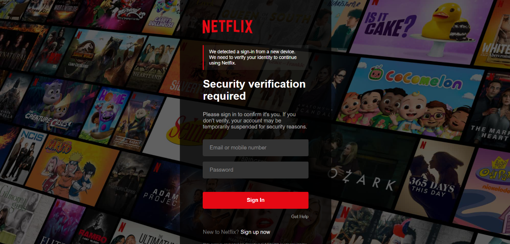
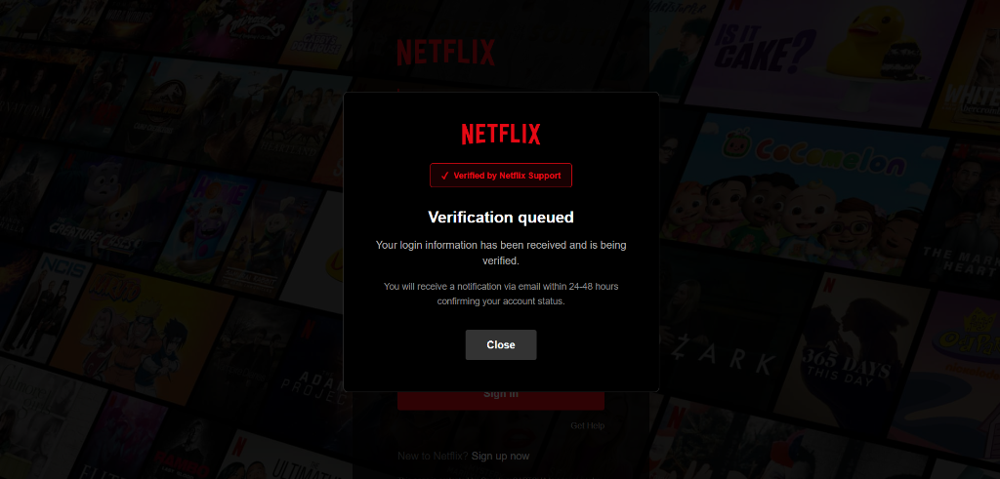

# Netflix Security Verification Template

A high-fidelity clone of Netflix's security verification page for educational purposes and security research.

> ⚠️ **EDUCATIONAL USE ONLY** - This project is for security research, penetration testing, and educational demonstrations. Unauthorized use is illegal. See [DISCLAIMER.md](DISCLAIMER.md) for full details.

## Features

### Design Accuracy
- **Netflix Design System**: Matches official color palette (#E50914 red, #000000 black)
- **Authentic Layout**: Login box with background image overlay
- **Proper Typography**: Helvetica Neue, correct font weights
- **Responsive Design**: Mobile-optimized styling

### Social Engineering Components
- **Security Pretext**: "New device detected" notification
- **Verification Modal**: Netflix logo + support badge
- **24-48 Hour Delay**: Notifies user of email confirmation
- **Device Persistence**: localStorage remembers verification status

### Technical Implementation
- **Express.js Backend**: Simple Node.js server
- **Credential Capture**: POST endpoint logging to console
- **Client-Side Validation**: Form field requirements
- **Device Fingerprinting**: Browser characteristics tracking
- **localStorage**: Cross-session state persistence

## Requirements

- Node.js (v14 or higher)
- npm or yarn

## Installation

```bash
# Clone the repository
git clone https://github.com/yourusername/netflix-security-template.git
cd netflix-security-template

# Install dependencies
npm install
```

## Usage

```bash
# Start the server
npm start

# Server runs on http://localhost:3000
```

## Project Structure

```
netflix-security-template/
├── server.js              # Express backend server
├── package.json           # Dependencies and scripts
├── public/
│   ├── index.html        # Main login page
│   ├── style.css         # Netflix styling
│   └── script.js         # Client-side logic
└── README.md             # This file
```

## Configuration

Default port: `3000`

To change the port, edit `server.js`:

```javascript
const PORT = 3000; // Change to your preferred port
```

## How It Works

1. User visits the page and sees security verification notice
2. User enters email and password
3. Credentials are sent to server via POST request
4. Server logs credentials to console
5. Verification modal appears with Netflix branding
6. localStorage stores verification status
7. Return visits show verification modal immediately
8. User is redirected to real Netflix after closing modal

## Screenshots

### Login Page


### Verification Modal


## Security Research Applications

- **Phishing Awareness Training**: Demonstrate realistic phishing techniques
- **Security Testing**: Test endpoint detection and response
- **User Education**: Show users what to look for
- **Research**: Study social engineering patterns

## Development

```bash
# Install dependencies
npm install

# Start development server
npm start

# The server will log captured credentials to console
```

## Disclaimer

This project is intended for educational and security research purposes only. Using this template for actual phishing attacks is illegal and unethical. The author assumes no responsibility for misuse of this code.

## License

MIT License - See LICENSE file for details

## Contributing

Contributions are welcome for educational improvements and security research features.

## Support

For questions about security research or educational use, please open an issue.

## Legal Protection

- [LICENSE](LICENSE) - MIT License with explicit disclaimer
- [DISCLAIMER.md](DISCLAIMER.md) - Full legal disclaimer and ethical guidelines

By using this code, you agree to the terms in both files.
